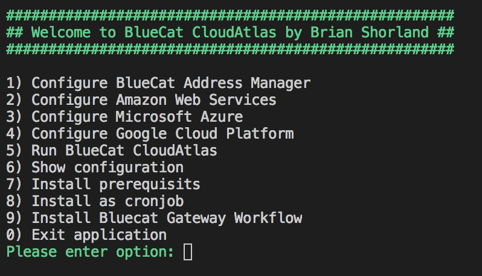

# CloudAtlas
Discover compute infrastructure from Amazon Web Service, Microsoft Azure and Google Compute, then dynamically add into BlueCat Address Manager 9.1

- Discovers AWS instances, automatically creates VPCs/VNETS as BlueCat configuration with Network Blocks/Subnets and inserts devices for instances
- Discovers Azure Virtual Machines, automatically create VPCs/VNETS as BlueCat configuration with Network Blocks/Subnets and inserts devices for instances
- Discovers GCP Compute instances, automatically create VPCs/VNETS BlueCat configuration with Network Blocks/Subnets and inserts devices for instances

# Installation

- Download
- Start python setup.py
- Select options

# Features

- All features of the origin source (Indigo360 codebase) -> Not finished yet
- User interface:
  - Configuration (Bluecat Address Manager, AWS, Azure and GCP)
  - Run BlueCat CloudAtlas
  - Show Configuration
  - Install prerequisits
  - Install CloudAtlas as Cronjob
  - Install CloudAtlas as BlueCat Gateway Workflow

